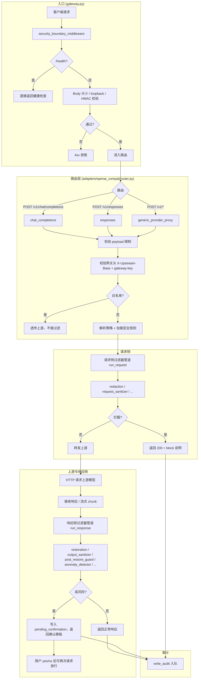

# AegisGate

AegisGate 是面向 LLM 调用的**安全网关**：Agent 与业务只对接网关，不直连上游模型，在网关层统一做**请求脱敏与拦截、响应检测与阻断、高风险确认放行**，实现「单点防御、可追溯」。

**隐私与数据**：本网关**不记录任何业务数据**，仅作为本地中间层做过滤与转发；请求与响应内容不落盘、不上报，从机制上避免经第三方转发导致隐私数据泄露。

**防御思路**：请求进入前做最小充分检查（脱敏 + 泄露/越权/注入检测），转发前不暴露上游地址与密钥；响应返回前做强检查（异常与投毒检测、必要时清洗或阻断）；流式响应支持分段检查与中途阻断；命中高风险时要求用户确认后再放行一次，避免自动执行危险指令。

**项目定位**：
- Agent 侧 `baseUrl` 固定指向网关，不持有真实上游地址
- 真实上游由请求头 `X-Upstream-Base` 动态指定，由网关校验与转发
- **所有请求必须通过 gateway-key 校验**：走 Token 的请求校验 token 是否在映射表中，不在则报错；不走 Token 的请求必须在 Header 中携带 `X-Upstream-Base` 与 `gateway-key`，缺一即拒。**推荐使用 Token 注册**（见方式二）。

## 1. 核心能力

**接口与协议**
- OpenAI 兼容：`POST /v1/chat/completions`、`POST /v1/responses`，以及 `/v1/*` 通用代理
- 流式：SSE 透传，支持流式增量检查与中途阻断

**请求侧防御**
- 可逆脱敏（redaction）：敏感内容在网关侧脱敏后转发，降低泄露面
- 泄露检查：防止 prompt/密钥/内部信息随请求流出
- 越权与注入拦截：高置信命中时直接拒绝，不转发上游

**响应侧防御**
- 异常与投毒检测：对模型输出做规则与策略检查
- 恢复后再检查：解码/还原后再次校验，必要时对内容清洗或整段阻断
- 流式分段检查：边收边检，发现问题可立即断流

**风险可控**
- 高风险确认放行：命中高风险时返回确认模板，用户 `yes/no` 决定是否执行一次，避免自动执行危险操作

**审计与扩展**
- 存储后端：`sqlite` / `redis` / `postgres`，用于审计与状态落盘
- 语义模块（可选）：独立异步语义服务，超时 + 熔断 + 缓存，用于灰区语义风险判断
- 边界加固（可选）：loopback 限制、HMAC 验签、nonce 防重放

## 2. 请求转发模型与配置方法

### 2.1 Agent 配置示例

> **提醒**：改用网关时，**只需把原来直连上游的 baseUrl 替换为网关的 baseUrl**（按下面方式一或方式二配置）；模型名、API Key、超时等**其余参数请保持原有配置**，按原使用方式填写。网关**不负责**这些参数的配置与校验，只做**转发与安全监测**。若因配置或参数问题导致出错，网关无法识别具体原因，**使用前建议先单独测试该渠道 API 能否跑通**。

**方式一：Header 传参**

在使用平台的配置中：baseUrl 填网关地址（如 `http://127.0.0.1:18080/v1`），在「自定义请求头」或类似配置项中填写 `X-Upstream-Base` 与 `gateway-key`。若平台**不支持或不确定是否支持**传入自定义 Header，建议使用方式二（Token 注册）。

（下例为**请求头**的键名，与方式二注册接口的 body 字段名不同：方式一用 header 名，方式二用 body 字段 `upstream_base`、`gateway_key`。）

```json
{
  "baseUrl": "http://127.0.0.1:18080/v1",
  "headers": {
    "X-Upstream-Base": "https://your-upstream.example.com/v1",
    "gateway-key": "agent"
  }
}
```

**方式二：Token 注册（一次注册，后续只填 baseUrl）**

通过网关提供的「注册口子」拿到短 token，之后请求只需把 baseUrl 设为带 token 的地址，无需再传 Header。

1. **注册**（一次性，浏览器/curl 均可）。请求体字段为 `upstream_base`、`gateway_key`（与方式一的 header 名不同，此处为 API body 字段名）：

```bash
curl -X POST http://127.0.0.1:18080/__gw__/register \
  -H "Content-Type: application/json" \
  -d '{"upstream_base": "https://your-upstream.example.com/v1", "gateway_key": "agent"}'
```

返回示例（首次注册）：

```json
{
  "token": "Ab3k9Qx7",
  "baseUrl": "http://127.0.0.1:18080/v1/__gw__/t/Ab3k9Qx7"
}
```

注册成功后，请在 Agent 或使用平台中将原来的 baseUrl 替换为返回的 `baseUrl`（即带 token 的网关地址）。

同一组 `upstream_base` + `gateway_key` 只能对应一个 token；重复注册会返回「已注册」及已有 token（`already_registered: true`）。

2. **查询已注册 token**（忘记 token 时可用）：

```bash
curl -X POST http://127.0.0.1:18080/__gw__/lookup \
  -H "Content-Type: application/json" \
  -d '{"upstream_base": "https://你的上游/v1", "gateway_key": "agent"}'
```

若存在则返回 `token`、`baseUrl`；若未注册则返回 404，需先调用 `/__gw__/register` 注册。

3. **使用**：平台/Agent 只填 `baseUrl = http://127.0.0.1:18080/v1/__gw__/t/Ab3k9Qx7`，再拼 `/chat/completions`、`/responses` 等路径即可，无需再带 `X-Upstream-Base` 和 `gateway-key`。若请求中仍带了这些 header（含下划线形式如 `gateway_key`），网关会**移除并以 token 映射为准**，避免参数冲突。

4. **删除 token**：

```bash
curl -X POST http://127.0.0.1:18080/__gw__/unregister \
  -H "Content-Type: application/json" \
  -d '{"token": "Ab3k9Qx7"}'
```

5. **映射存储**：token 与上游的映射保存在 `config/gw_tokens.json`，启动时自动加载；用户可手动编辑该文件，重启后生效。

说明：
- 业务请求发给网关，不直连第三方。
- **一 upstream 一 token**：同一组 `upstream_base` + `gateway_key` 只能注册一个 token，重复注册会返回“已注册”及已有 token；忘记 token 时可调用 `POST /__gw__/lookup` 传入同组参数查询，未注册则返回 404。
- **统一校验**：所有 `/v1` 接口均须通过 gateway-key 校验。方式一：请求头必须带 `X-Upstream-Base` 与 `gateway-key`，缺少或错误时网关返回参数错误。方式二：请求 path 为 `/v1/__gw__/t/{token}/...`，网关校验 token 是否在映射表中，不在则返回 404。
- **推荐使用方式二（Token 注册）**：一次注册后只需配置 baseUrl，无需每次带 Header。
- 命中上游白名单 `AEGIS_UPSTREAM_WHITELIST_URL_LIST` 时，网关可直接透传不做过滤。

### 2.2 网关处理链

1. **Token 路径重写**（若请求 path 为 `/v1/__gw__/t/{token}/...`）：根据 token 解析上游与 key，重写为 `/v1/...` 并注入 `X-Upstream-Base`、`gateway-key`，再进入后续步骤。
2. 校验网关头（`X-Upstream-Base` + `gateway-key`）。
3. 请求侧脱敏与最小充分检查。
4. 转发到上游模型。
5. 响应侧强检查（含流式分段检查）。
6. 命中高风险则进入确认流程；否则直接返回。

### 2.3 请求处理流程示意（代码路径）

以下流程图对应项目内从接收到响应的完整代码路径，便于对照源码阅读。



**对应文件与位置**：

| 阶段 | 文件 | 说明 |
|------|------|------|
| 入口与边界 | `aegisgate/core/gateway.py` | 中间件、路由挂载 |
| 路由与校验 | `aegisgate/adapters/openai_compat/router.py` | `chat_completions`、`responses`、`generic_provider_proxy`；网关头校验、白名单、策略解析在各自处理函数内 |
| 请求侧过滤 | 同上 + `aegisgate/filters/*`、`aegisgate/policies/*` | `_run_request_pipeline`；策略与规则决定启用哪些 filter |
| 转发上游 | 同上 | `_execute_chat_once` / `_execute_chat_stream_once`、`_execute_responses_*` 等 |
| 响应侧过滤 | 同上 | `_run_response_pipeline` |
| 确认与审计 | 同上 + `aegisgate/core/audit.py` | 高风险写入 store（pending_confirmation）；`write_audit` 入队写审计 |

## 3. 本地开发运行

### 3.1 安装

```bash
python -m pip install -e .
```

可选依赖：

```bash
# Redis 后端
python -m pip install -e .[redis]

# PostgreSQL 后端
python -m pip install -e .[postgres]
```

### 3.2 启动

```bash
uvicorn aegisgate.core.gateway:app --host 127.0.0.1 --port 18080 --reload
```

### 3.3 健康检查

网关提供健康检查接口，请求后返回 `{"status":"ok"}` 表示运行正常。

- **健康测试链接**（本地启动后可在浏览器打开或用于监控探测）：  
  [http://127.0.0.1:18080/health](http://127.0.0.1:18080/health)
- 命令行校验：

```bash
curl http://127.0.0.1:18080/health
```

## 4. Docker 一键部署

### 4.1 下载

从 GitHub 克隆仓库：

```bash
git clone https://github.com/ax128/AegisGate.git
cd AegisGate
```

### 4.2 首次运行前准备

Compose 会读取 `config/.env`（仓库中仅提供 `config/.env.example`）。**首次启动前**若该文件不存在，请执行：

```bash
cp config/.env.example config/.env
```

可按需编辑 `config/.env`（如 `AEGIS_LOG_LEVEL`、`AEGIS_GATEWAY_KEY`、`AEGIS_UPSTREAM_BASE_URL` 等）。若已存在 `config/.env` 可跳过此步。策略与规则 YAML 可选：将 `aegisgate/policies/rules/*.yaml` 复制到 `config/` 可覆盖默认策略，详见 `config/README.md`；不复制则使用内置默认策略。

### 4.3 启动

```bash
docker compose up -d --build
```

启动后可用同一健康测试链接确认网关已就绪：[http://127.0.0.1:18080/health](http://127.0.0.1:18080/health)（返回 `{"status":"ok"}`）。

### 4.4 查看日志

```bash
docker compose logs -f aegisgate
```

### 4.5 停止

```bash
docker compose down
```

默认端口映射：`127.0.0.1:18080:18080`（仅本机可访问）。

## 5. API 使用示例

### 5.1 Chat Completions

```bash
curl -X POST http://127.0.0.1:18080/v1/chat/completions \
  -H 'Content-Type: application/json' \
  -H 'X-Upstream-Base: https://your-upstream.example.com/v1' \
  -H 'gateway-key: agent' \
  -d '{
    "model": "your-chat-model",
    "messages": [{"role": "user", "content": "hello"}]
  }'
```

### 5.2 Responses

```bash
curl -X POST http://127.0.0.1:18080/v1/responses \
  -H 'Content-Type: application/json' \
  -H 'X-Upstream-Base: https://your-upstream.example.com/v1' \
  -H 'gateway-key: agent' \
  -d '{
    "model": "your-response-model",
    "input": "hello"
  }'
```

### 5.3 Relay（可选）

- 路由：`POST /relay/generate`
- 默认关闭，需设置 `AEGIS_ENABLE_RELAY_ENDPOINT=true`
- 开启后复用 `/v1/chat/completions` 同一安全链

### 5.4 通用接口兼容

网关支持 `/v1/*` 通用代理入口，可直接承接非 OpenAI schema 的 JSON 接口。

示例（通用 messages）：

```bash
curl -X POST http://127.0.0.1:18080/v1/messages \
  -H 'Content-Type: application/json' \
  -H 'X-Upstream-Base: https://your-upstream.example.com/v1' \
  -H 'gateway-key: agent' \
  -d '{
    "model": "your-generic-model",
    "messages": [{"role":"user","content":"hello"}]
  }'
```

示例（通用模型路由）：

```bash
curl -X POST http://127.0.0.1:18080/v1/models/your-model:generateContent \
  -H 'Content-Type: application/json' \
  -H 'X-Upstream-Base: https://your-upstream.example.com/v1' \
  -H 'gateway-key: agent' \
  -d '{
    "contents":[{"parts":[{"text":"hello"}]}]
  }'
```

说明：多模态（图片/音频/视频）结构会保持原样透传上游，网关仅提取文本副本用于安全分析。

**上游失败时返回给 Agent 的原因**：上游不可达、超时或 HTTP 错误时，网关会将失败原因返回给调用方，便于 Agent 区分并处理。流式响应：SSE 中会下发一条 `data:` 块，JSON 含 `error`（完整说明）与 `code`（如 `upstream_unreachable`、`upstream_http_error`）；非流式：返回 502/5xx 及 JSON 体中的 `error`、`detail` 字段。

## 6. 高风险确认机制

当响应命中高风险时，网关返回确认模板与 `CONFIRM_ID`，并缓存 pending 请求。

- 允许执行（一次）：
  - 英文：`yes`, `y`, `ok`, `okay`, `confirm`, `proceed`, `continue`
  - 中文：`是`, `是的`, `确认`, `同意`, `继续`, `执行`, `好的`
- 拒绝执行：
  - 英文：`no`, `n`, `cancel`, `stop`, `reject`
  - 中文：`否`, `不是`, `取消`, `拒绝`, `不要`, `停止`

pending 记录包含：`confirm_id / payload_hash / status / expires_at / retained_until`。

**回复 yes 后要能放行**：下一次请求必须满足其一：① 使用与「触发确认的那次请求」相同的 `session_id`；② 或在本次消息内容中包含确认编号（例如 `yes cfm-abc123def456`）。否则网关无法关联到待放行记录。放行时网关会跳过请求侧过滤，直接转发原请求到上游。

**重启后不保留旧待确认**：每次网关进程启动时会清空数据库中的全部 pending 记录，因此只有本次运行期间产生的新请求可被确认放行；重启前的「错误请求」或未确认记录不会保留。

## 7. 语义服务接入（异步）

网关语义模块调用外部 HTTP 服务（灰区触发）：

- 请求：`POST $AEGIS_SEMANTIC_SERVICE_URL`
- Body：

```json
{"text": "待分析文本"}
```

- 响应：

```json
{
  "risk_score": 0.87,
  "tags": ["semantic_leak"],
  "reasons": ["semantic_secret_or_prompt_leak"]
}
```

策略：
- 超时：按 `AEGIS_SEMANTIC_TIMEOUT_MS` 降级
- 熔断：失败阈值 `AEGIS_SEMANTIC_CIRCUIT_FAILURE_THRESHOLD`，打开时长 `AEGIS_SEMANTIC_CIRCUIT_OPEN_SECONDS`
- 缓存：`AEGIS_SEMANTIC_CACHE_TTL_SECONDS` + `AEGIS_SEMANTIC_CACHE_MAX_ENTRIES`

## 8. 关键环境变量

- 基础
  - `AEGIS_LOG_LEVEL`：日志等级（`debug|info|warning|error|critical`，默认 `info`）。设为 `debug` 时：① 每次请求会打印 method/path/route/headers 及 **body_size**（不打印正文除非开启下一项）；② 拦截/脱敏/block 处会打印**相关原文摘要**（截断约 180～500 字，视场景）。
  - `AEGIS_LOG_FULL_REQUEST_BODY`：默认 `false`。仅在 **DEBUG** 下生效：为 `true` 时在①中额外打印完整请求正文（过大则分段打印）；为 `false` 时只打 body_size，不打印正文。
  - `AEGIS_HOST`（默认 `127.0.0.1`）
  - `AEGIS_PORT`（默认 `18080`）
  - `AEGIS_GATEWAY_KEY`（默认 `agent`）
  - `AEGIS_GATEWAY_KEY_HEADER`（默认 `gateway-key`）
- 上游
  - `AEGIS_UPSTREAM_BASE_HEADER`（默认 `x-upstream-base`）
  - `AEGIS_UPSTREAM_BASE_URL`（可选，请求头未指定上游时使用的默认上游 base URL）
  - `AEGIS_UPSTREAM_TIMEOUT_SECONDS`
  - `AEGIS_UPSTREAM_MAX_CONNECTIONS`
  - `AEGIS_UPSTREAM_MAX_KEEPALIVE_CONNECTIONS`
  - `AEGIS_UPSTREAM_WHITELIST_URL_LIST`（逗号分隔）
- 安全策略
  - `AEGIS_SECURITY_LEVEL`：`high|medium|low`（默认 `medium`；三档均已整体放宽阈值、减少误拦，机制成熟前建议用 medium 或 low）。**脱敏（redaction）仅做替换、不参与拦截**，不受此档位放宽影响。未挂载策略/规则文件时，代码内默认也为放宽（如 `secret_exfiltration: review`、策略默认阈值 0.85）。
  - `AEGIS_CONFIRMATION_TTL_SECONDS`
  - `AEGIS_PENDING_DATA_TTL_SECONDS`（默认 24h）
- 存储
  - `AEGIS_STORAGE_BACKEND`：`sqlite|redis|postgres`
  - `AEGIS_REDIS_URL`
  - `AEGIS_REDIS_KEY_PREFIX`
  - `AEGIS_POSTGRES_DSN`
  - `AEGIS_POSTGRES_SCHEMA`
- 语义
  - `AEGIS_ENABLE_SEMANTIC_MODULE`
  - `AEGIS_SEMANTIC_SERVICE_URL`
  - `AEGIS_SEMANTIC_GRAY_LOW`
  - `AEGIS_SEMANTIC_GRAY_HIGH`
  - `AEGIS_SEMANTIC_TIMEOUT_MS`
  - `AEGIS_SEMANTIC_CACHE_TTL_SECONDS`
  - `AEGIS_SEMANTIC_CACHE_MAX_ENTRIES`
  - `AEGIS_SEMANTIC_CIRCUIT_FAILURE_THRESHOLD`
  - `AEGIS_SEMANTIC_CIRCUIT_OPEN_SECONDS`
- 网关边界（可选）
  - `AEGIS_ENFORCE_LOOPBACK_ONLY`
  - `AEGIS_ENABLE_REQUEST_HMAC_AUTH`
  - `AEGIS_REQUEST_HMAC_SECRET`
  - `AEGIS_REQUEST_SIGNATURE_HEADER`
  - `AEGIS_REQUEST_TIMESTAMP_HEADER`
  - `AEGIS_REQUEST_NONCE_HEADER`
  - `AEGIS_REQUEST_REPLAY_WINDOW_SECONDS`
  - `AEGIS_NONCE_CACHE_BACKEND`：`memory|redis`

## 9. 项目结构

```text
aegisgate/
  adapters/        # OpenAI/Relay 兼容入口
  core/            # 网关核心、上下文、审计、边界
  filters/         # 各类安全过滤器
  policies/        # 策略与规则
  storage/         # sqlite/redis/postgres
  tests/           # 测试
Dockerfile
docker-compose.yml
README.md
```
